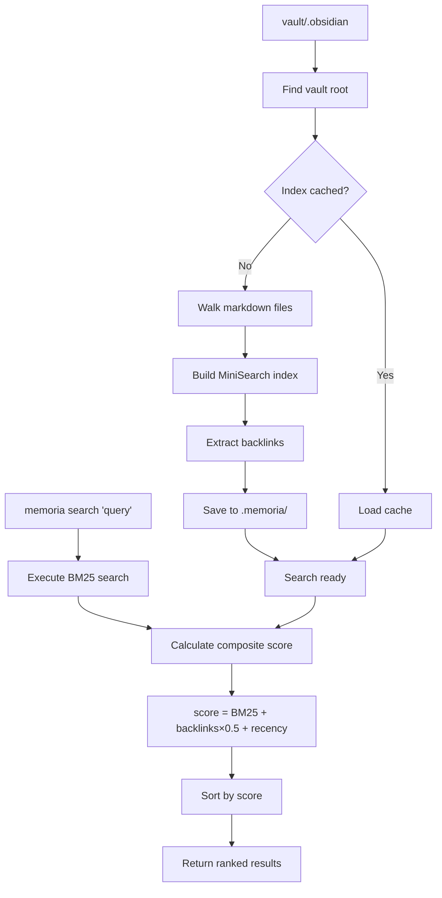
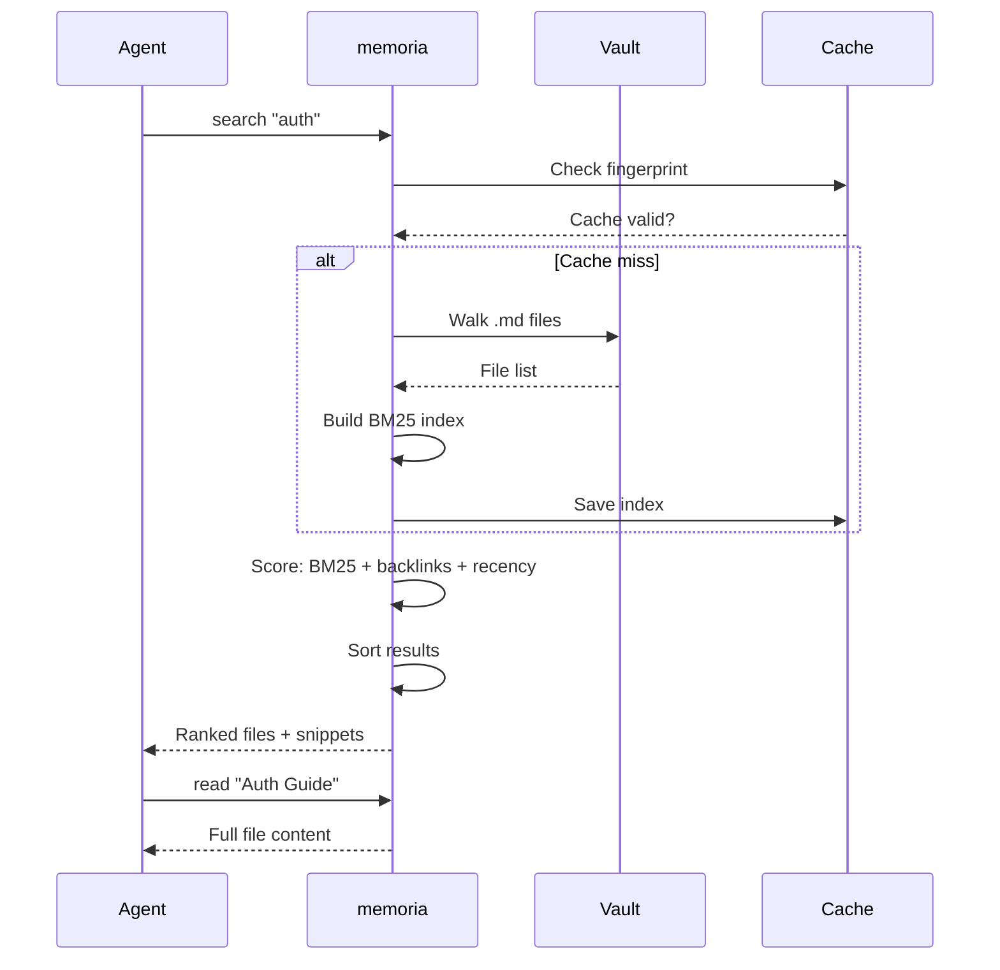

# memoria

*_This tool was made in 1 session, pure slop, read:_*

BM25 search for Obsidian vaults — pi-first agent memory system.

No embeddings, no graphs, no preprocessing. Just full-text search with recency boosting.

## Features

- **BM25 search** — Full-text search using MiniSearch
- **Recency boosting** — Recent notes rank higher
- **Backlink awareness** — Linked notes get a boost
- **Auto-detect vault** — Works with any Obsidian vault structure
- **Agent-first CLI** — JSON output, no decoration, progressive disclosure

## How it works





## Installation

This is a pi skill — it provides documentation and CLI tools for the pi coding agent.

```bash
# Install as pi package
pi install git:github.com/fr0ziii/memoria

# Or clone into your skills folder
git clone https://github.com/fr0ziii/memoria.git .pi/skills/memoria

# Build the CLI (requires bun)
cd .pi/skills/memoria
bun install
bun build --compile src/index.ts --outfile memoria
```

## Usage

```bash
# Search notes
memoria search "authentication"

# Read a file
memoria read "Architecture"

# Vault info
memoria vault
```

## Options

| Flag | Description |
|------|-------------|
| `--json` | JSON output |
| `--limit <n>` | Max results (default: 10) |
| `--snippet-lines <n>` | Context lines around matches |
| `--score` | Show relevance score |
| `--links` | Show backlink counts |
| `--rebuild` | Force cache rebuild |

## Scoring

```
score = BM25 + backlinks × 0.5 + recency
```

- **BM25** — Text relevance
- **backlinks** — Files linking to this (0.5x boost)
- **recency** — Normalized 0-1 based on file mtime

## Development

```bash
bun install
bun run dev -- vault
bun run dev -- search "query"
```

## License

MIT — see [LICENSE.md](LICENSE.md)
